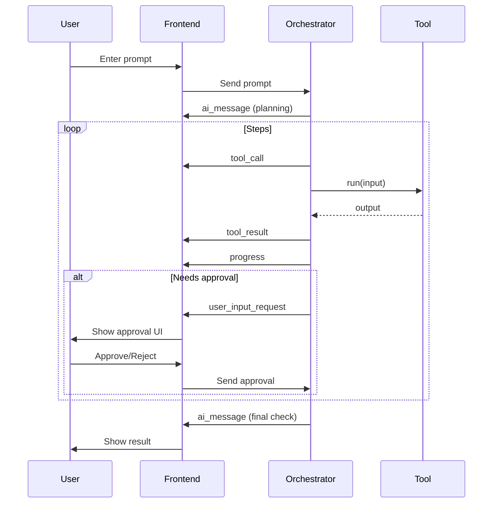

# Sclip AppFlow (Agentic Gemini 2.5 Pro Orchestrator)

## Core User Flow

1. **User Prompt:** The user initiates a request (e.g., "Make a Messi video").
2. **Agentic Planning:** The Sclip brain (Gemini 2.5 Pro) breaks down the request into a sequence of tasks.
3. **Tool Calls:** For each task, the orchestrator calls deterministic, non-AI tools (e.g., script generator, b-roll finder, video editor, voiceover synthesizer).
4. **Verification:** The orchestrator verifies each tool's output, ensuring it meets the user's intent.
5. **Real-Time Updates:** Progress, tool calls, and results are streamed to the frontend, keeping the user informed.
6. **User Control:** The user can stop the process at any time to make changes or modifications.
7. **Iterative Loop:** The agentic loop continues until the user's request is fully satisfied.

---

## User Context & Adaptive Workflow

### Continuous Process with User Control

**Standard Flow:**
- User: "Make a Messi video"
- Sclip: "Creating your Messi video with your preferred cinematic style and professional voice."
- Sclip: "Script generated ✓, B-roll found ✓, Voiceover created ✓, Video assembled ✓"
- Sclip: "Your video is ready! [Download] [Preview] [Make Changes]"

**User Interruption Example:**
- User: "Make a Messi video"
- Sclip: "Creating your Messi video..."
- Sclip: "Script generated ✓"
- User: [Clicks "Stop" button] "I want to change the script"
- Sclip: "Process paused. You can edit the script and resume when ready."
- User: [Edits script] [Clicks "Resume"]
- Sclip: "Resuming with your updated script..."
- Sclip: "B-roll found ✓, Voiceover created ✓, Video assembled ✓"
- Sclip: "Your video is ready! [Download] [Preview] [Make Changes]"

### Context Learning
- Sclip remembers user preferences and adapts behavior
- Learns from user feedback to improve future sessions
- Maintains style preferences across sessions
- Reduces approval requests for trusted patterns

---

## Example Flow

- User: "Make a Messi video."
- Sclip Brain: "Step 1: Generating script..."
- [Tool Call] Script Generator (deterministic)
- Sclip Brain: "Step 2: Finding B-roll..."
- [Tool Call] B-roll Finder (deterministic)
- ...

## Technical Summary (Backend Architecture)

- The orchestrator is a Gemini 2.5 Pro agent that manages the entire workflow, planning, calling tools, verifying results, updating the user, and handling retries/user intervention.
- All tools are deterministic, non-AI functions (e.g., video editing, b-roll search, script generation, voiceover synthesis, etc.).
- Handles dual-response pattern: user messages and tool calls in the same AI response.
- Maintains per-session context, state, and retry counters in memory and persistent storage.
- Manages files per session/project, with APIs for upload/download and cleanup.
- Tracks users and sessions, with optional authentication and preferences.
- Exposes FastAPI endpoints for prompt submission, streaming, file management, and approvals.
- Uses WebSocket/SSE for real-time streaming of orchestrator messages.
- Logs all tool calls, errors, and user actions for debugging and monitoring.
- Extensible via plugin system and config-driven workflows.
- Enforces security and privacy: input validation, file sandboxing, and local-first data.

---

## Detailed Orchestration & User Interaction Flow

### State Machine Summary
- Awaiting Prompt → Planning Steps → Executing Step → Awaiting User Approval → Next Step/Error → Final Check → Done

### Sequence Diagram (Mermaid)

### Message Types & User Experience
- **ai_message:** User sees agent's explanation of current step
- **tool_call:** User sees which tool is being used and with what arguments
- **progress:** User sees progress bars and status updates
- **tool_result:** User sees output/previews (script, b-roll, audio, video)
- **process_paused:** Process is paused, waiting for user changes
- **error:** User sees error messages and can intervene

---

## Real-Time GUI Integration Requirements

### ⚠️ CRITICAL: All Backend Changes Must Be Immediately Visible in GUI

**Script Tab Integration:**
- Generated scripts automatically appear in the Script tab with live updates
- Script content is editable and changes are synced back to orchestrator
- Script generation progress shows real-time typing/creation effect
- Script preview shows syntax highlighting and formatting

**Project Files Tab Integration:**
- All downloaded B-roll files immediately appear in Project Files tab with thumbnails
- Generated audio files (voiceovers) appear with waveform previews
- Video assets show duration, resolution, and preview thumbnails
- File organization by type (video, audio, images, scripts) with search/filter
- File metadata (size, format, duration) displayed for each asset

**Video Preview Area Integration:**
- Generated videos automatically load in the video preview area
- Video preview only shows downloaded/playing content (never empty during generation)
- Real-time preview updates as video assembly progresses
- Preview shows current state of video with applied effects/transitions
- Video controls (play, pause, seek, volume) for preview functionality

**Effects/Transitions/Filters/Voices Integration:**
- All available effects, transitions, filters, and voices are selectable in prompt area
- Applied effects show visual previews and can be adjusted
- Voice selection shows available voices with audio previews
- Filter effects show before/after previews
- Effects library with categories and search functionality

**Timeline Integration:**
- Video timeline updates in real-time as clips are added/assembled
- Applied effects and transitions show on timeline with visual indicators
- Audio tracks show voiceover placement and timing
- Timeline shows clip durations, transitions, and effect markers

**Chat/Interaction Panel Integration:**
- All orchestrator messages stream in real-time
- Tool calls and results are transparently displayed
- Stop/Resume buttons for user control
- Error messages and retry options are clearly presented
- Progress updates show current step and completion percentage

**Settings/Preferences Panel Integration:**
- User preferences are immediately reflected in orchestrator behavior
- Style preferences affect tool parameters in real-time
- Quality settings adjust tool execution parameters
- Process control settings for user interruption behavior

---

## Notes
- All tools are deterministic and non-AI; the AI agent (Gemini 2.5 Pro) handles all planning, decision-making, and orchestration.
- The system is designed for agentic, autonomous orchestration with real-time, transparent user updates.
- See MasterPlan.md and Architecture.md for the full backend implementation plan.
- User context and preferences are maintained across sessions for adaptive behavior.
- The frontend provides real-time, Cursor-like transparency for all backend operations.

This flow ensures the user is always informed, can interact at every step, and sees real-time progress as the orchestrator manages the entire workflow.
