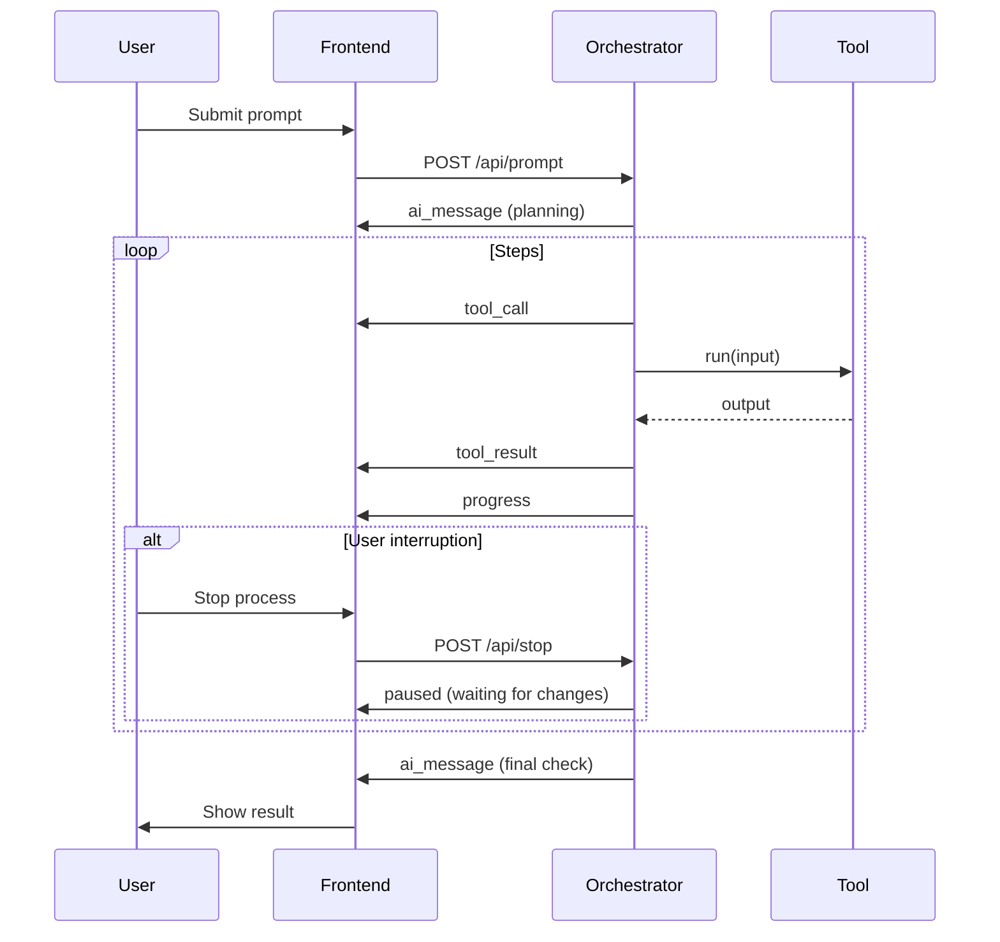

# Sclip Architecture (Agentic Gemini 2.5 Pro Orchestrator)

## High-Level Overview
Sclip is a local-first, AI-powered video editor with a tab-based UI. The backend is built around a fully agentic orchestrator (SclipBrain) powered by Gemini 2.5 Pro. The Sclip brain autonomously plans, decides, and executes the entire editing workflow by calling a suite of deterministic, non-AI tools. Every tool call, result, and progress update is streamed to the frontend, and the user can intervene or approve at any step.

**Core Philosophy:**
- **Agentic Orchestrator:** The AI agent manages the entire workflow, using deterministic tools as building blocks
- **Deterministic Tools:** All actual work (script generation, b-roll search, video editing, voiceover synthesis) is done by non-AI, deterministic functions
- **Real-Time Transparency:** Every step, tool call, and result is streamed live to the user
- **User-in-the-Loop:** Users can intervene, approve, or request changes at any step
- **Strong Context Management:** User preferences and context are maintained across sessions

---

## Backend System Architecture: Full Plan for a Working Backend

### 1. Core Orchestrator (Agentic Loop Engine)
- Receives user prompts and session context.
- Breaks down requests into steps (script, b-roll, voiceover, edit, etc.).
- Calls deterministic tools for each step, passing correct arguments.
- Verifies tool outputs (file existence, content checks, etc.).
- Handles retries (up to 3x), error reporting, and fallback logic.
- Streams all actions, progress, and results to the frontend in real time.
- Allows users to stop and modify the process at any time if they want changes.
- Maintains session state, history, and context.
- Final satisfaction check and session closure.

**Implementation:**
- Python (for AI orchestration, tool integration, and flexibility).
- State machine or event-driven architecture for clarity and extensibility.
- Tool calls via subprocess, RPC, or direct Python imports.
- WebSockets or Server-Sent Events (SSE) for real-time updates.
- Async/await for non-blocking tool calls and streaming.

---

### 2. Context & State Management
- Maintain per-session context (user prompt, current step, tool outputs, user approvals, etc.).
- Store conversation history for replay, debugging, and user transparency.
- Track retry counts, error logs, and intervention points.

**Implementation:**
- In-memory Python objects for fast, per-session state.
- Lightweight database (SQLite, TinyDB, or Redis) to persist session state, history, and logs.
- Unique session IDs for tracking and retrieval.

---

### 2.1 User Context & Adaptive Behavior
- Store user preferences (approval settings, style preferences, interaction level).
- Maintain context across sessions (previous feedback, successful patterns, style learning).
- Adapt orchestrator behavior based on user preferences and historical context.
- Learn from user interactions to improve future sessions.

**User Preferences:**
- **Style Preferences:** Video style, voice type, editing pace, content themes
- **Quality Settings:** Draft, standard, high quality
- **Notification Preferences:** Desktop, email, silent
- **Process Control:** Users can stop and modify at any time

**Context Memory:**
- Session history with satisfaction ratings and intervention points
- User feedback patterns and successful content themes
- Style preferences inferred from behavior
- Error patterns and user help requests

**Implementation:**
- User preferences stored as JSON in database
- Context vector embeddings for similarity matching
- Session history with metadata (satisfaction, interventions, style)
- Preference inference from user behavior
- Context-aware orchestrator prompts

---

### 3. Tool Abstraction Layer
- Standard interface for all deterministic tools (input schema, output schema, error handling).
- Register and discover available tools dynamically.
- Validate tool arguments and outputs.
- Handle tool-specific errors and timeouts.

**Implementation:**
- Tool registry (Python module or config file).
- Base class or protocol for tools (e.g., `run(input) -> output`).
- Pydantic or Marshmallow for input/output schema validation.
- Subprocess timeouts or async calls to prevent hanging.

---

### 4. File & Storage Management
- Manage all files generated/used by tools (scripts, b-roll, audio, video, temp files).
- Organize files per session/project for easy retrieval and cleanup.
- Handle file uploads (user-provided assets) and downloads (final video, previews).
- Enforce storage quotas and cleanup policies.

**Implementation:**
- Directory structure per session/project.
- File API for upload, download, and listing.
- Periodic cleanup job for old/unused files and temp data.
- Local disk storage, abstracted for future cloud support.

---

### 5. User & Session Management
- Track users (even if local, for multi-user or future cloud support).
- Manage authentication (optional for local, but architect for future).
- Store user preferences, history, and saved projects.

**Implementation:**
- Simple user/session table in SQLite or similar.
- Start with anonymous sessions; add OAuth/local auth if needed.
- Preferences as JSON blobs or in a user settings table.

---

### 6. API Layer (Frontend Communication)
- Endpoints for submitting prompts/requests, streaming progress/results, uploading/downloading assets, approving/denying steps, fetching session/project history.
- Input validation and error handling.

**Implementation:**
- FastAPI (Python) for async, type-safe, and auto-documented APIs.
- WebSocket/SSE for real-time streaming.
- REST endpoints for file management, session control, etc.
- CORS enabled for local frontend development.

---

### 7. Logging, Monitoring, and Debugging
- Log all tool calls, errors, user actions, and system events.
- Debug mode for verbose output and step-by-step replay.
- Health/status endpoints for monitoring.

**Implementation:**
- Python logging module, with log files per session.
- Simple `/health` endpoint; add Prometheus/Grafana for advanced metrics.
- Optional admin panel for viewing session logs and state.

---

### 8. Extensibility & Modularity
- Easy to add new tools, steps, or workflows.
- Plugin-like architecture for future expansion (e.g., new video effects, export formats).

**Implementation:**
- Plugin system using Python entry points or a plugin registry.
- Config-driven workflows via config files or YAML.

---

### 9. Security & Privacy
- All user data and files are local and private by default.
- Sanitize all tool inputs/outputs to prevent code injection or file system abuse.
- Plan for future encryption, user authentication, and access controls.

**Implementation:**
- Input validation and sanitization.
- File permissions restricted to project/session directories.
- Optional encryption for sensitive data or future cloud sync.

---

### 10. Documentation & Developer Experience
- Document all APIs, tool interfaces, and workflows.
- Clear onboarding for new contributors.
- Example scripts, test cases, and a local dev setup guide.

**Implementation:**
- FastAPI's built-in OpenAPI docs.
- Comprehensive README with architecture, setup, and usage.
- Pytest for backend logic and tool integration.

---

### Extra Suggestions
- Version all tools and workflows for reproducibility.
- Track tool usage, errors, and user actions for analytics.
- Allow users to export/import projects for backup or sharing.
- Optional: Desktop notifications or email for long-running jobs.
- Architect storage and user/session management for easy migration to cloud or multi-device sync.
- Store and version the system prompt for the orchestrator for easy iteration and improvement.

---

## Agentic Workflow & Real-Time Interaction

### State Machine / Workflow
- **States:** Awaiting Prompt, Planning, Executing Step, Handling Error/Retry, User Interruption, Final Check, Done
- **Transitions:** User prompt → Planning → Executing → Next Step/Error → Final Check → Done

### Sequence Diagram (Mermaid)


### Streaming Message Types
- **ai_message:** Agent's user-facing message
- **tool_call:** Tool being called, with arguments
- **tool_result:** Output/result of tool
- **progress:** Step, percent, status
- **process_paused:** Process paused, waiting for user changes
- **error:** Error details if something fails

### Dual-Response Pattern
- Each LLM response includes both a user message and a backend action (tool call, state update, etc.)
- Example:
```json
{
  "ai_message": "Now generating voiceover...",
  "tool_call": {
    "tool": "voiceover_generator",
    "args": {"script_text": "...", "voice": "en-US"}
  }
}
```

---

## Real-Time GUI Integration Requirements

### ⚠️ CRITICAL: All Backend Changes Must Be Immediately Visible in GUI

**Script Tab Integration:**
- Generated scripts automatically appear in the Script tab with live updates
- Script content is editable and changes are synced back to orchestrator
- Script generation progress shows real-time typing/creation effect
- Script preview shows syntax highlighting and formatting

**Project Files Tab Integration:**
- All downloaded B-roll files immediately appear in Project Files tab with thumbnails
- Generated audio files (voiceovers) appear with waveform previews
- Video assets show duration, resolution, and preview thumbnails
- File organization by type (video, audio, images, scripts) with search/filter
- File metadata (size, format, duration) displayed for each asset

**Video Preview Area Integration:**
- Generated videos automatically load in the video preview area
- Video preview only shows downloaded/playing content (never empty during generation)
- Real-time preview updates as video assembly progresses
- Preview shows current state of video with applied effects/transitions
- Video controls (play, pause, seek, volume) for preview functionality

**Effects/Transitions/Filters/Voices Integration:**
- All available effects, transitions, filters, and voices are selectable in prompt area
- Applied effects show visual previews and can be adjusted
- Voice selection shows available voices with audio previews
- Filter effects show before/after previews
- Effects library with categories and search functionality

**Timeline Integration:**
- Video timeline updates in real-time as clips are added/assembled
- Applied effects and transitions show on timeline with visual indicators
- Audio tracks show voiceover placement and timing
- Timeline shows clip durations, transitions, and effect markers

**Chat/Interaction Panel Integration:**
- All orchestrator messages stream in real-time
- Tool calls and results are transparently displayed
- User intervention points appear as interactive buttons/forms
- Error messages and retry options are clearly presented
- Progress updates show current step and completion percentage

**Settings/Preferences Panel Integration:**
- User preferences are immediately reflected in orchestrator behavior
- Style preferences affect tool parameters in real-time
- Approval settings control intervention frequency
- Quality settings adjust tool execution parameters

---

## Summary Table

| Component                | Responsibilities                                      | Implementation Suggestions                |
|--------------------------|-------------------------------------------------------|-------------------------------------------|
| Orchestrator             | Agentic loop, tool calls, verification, streaming     | Python, state machine, WebSocket/SSE      |
| Context/State Mgmt       | Session state, history, retry tracking                | In-memory + SQLite/Redis                  |
| Tool Abstraction         | Standard interface, validation, registry              | Python base class, Pydantic, timeouts     |
| File/Storage Mgmt        | File org, uploads/downloads, cleanup                  | Per-session dirs, API, cleanup jobs       |
| User/Session Mgmt        | User tracking, auth, preferences                      | Simple user model, JSON settings          |
| API Layer                | Endpoints, streaming, validation                      | FastAPI, REST, WebSocket/SSE              |
| Logging/Monitoring       | Logs, debug, health                                   | Python logging, /health, admin panel      |
| Extensibility            | Plugins, config-driven workflows                      | Plugin registry, YAML configs             |
| Security/Privacy         | Data privacy, input sanitization, permissions         | Validation, file sandboxing, encryption   |
| Docs/Dev Experience      | API docs, onboarding, tests                           | OpenAPI, README, Pytest                   |

---

## Critical Architectural Improvements

To ensure Sclip is robust, user-friendly, and reliable, the following architectural improvements are necessary:

1. **Strongly-Typed, Unified Messaging Layer**
   - Prevents frontend/backend communication bugs and ensures all messages (progress, tool call, error, etc.) are well-formed and expected. This guarantees the UI always reflects the true backend state.
2. **Unified Error Handling & User Feedback**
   - Provides users with clear, actionable error messages and recovery options. Consistent error handling builds trust and makes the app feel professional.
3. **Decoupling Orchestrator and Tools (Async/Message Bus or at least Subprocess Isolation)**
   - Prevents a slow or crashing tool from freezing the orchestrator or the entire app. Keeps the UI responsive and the orchestrator stable.
4. **Session State Persistence (DB or Event Sourcing)**
   - Ensures user progress isn’t lost if the app crashes or restarts. Enables session recovery, history, and transparency for multi-step workflows.
5. **Basic Tool Sandboxing/Security**
   - Prevents tools from accidentally or maliciously corrupting files or accessing unauthorized data. Even for local apps, this is important for safety and trust.
6. **Comprehensive Input Validation and Sanitization**
   - Prevents invalid or malicious data from breaking the app or causing security issues. Applies to all user input, API requests, and file uploads.
7. **Robust Logging and Monitoring**
   - Essential for debugging, user support, and reliability. Enables tracing issues, monitoring health, and recovering from failures.
8. **Real-Time Streaming Infrastructure**
   - Guarantees the UI is always in sync with backend actions, which is core to the Cursor-like experience.
9. **Retry Logic and Graceful Degradation**
   - Ensures the system can recover from transient failures (e.g., tool or network hiccups) without user frustration.
10. **Secure File Management and Cleanup**
    - Prevents storage bloat, data leaks, and security issues from leftover or improperly handled files. Includes per-session directories, cleanup jobs, and file validation.

---

## Conclusion
Sclip's backend architecture is now fully actionable for implementation. The agentic orchestrator manages the entire workflow, using deterministic tools as building blocks, and delivers a transparent, interactive, and robust editing experience with real-time, Cursor-like user engagement. This plan provides a detailed blueprint for building a working backend, covering all critical infrastructure, best practices, and extensibility for future growth.
